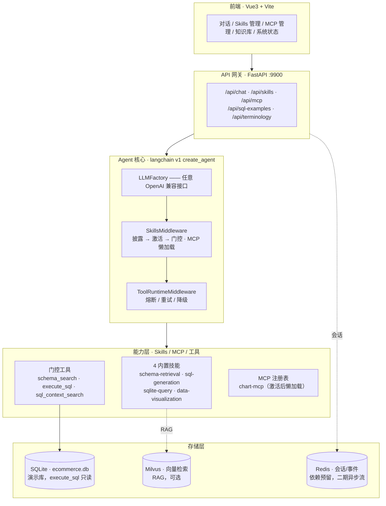
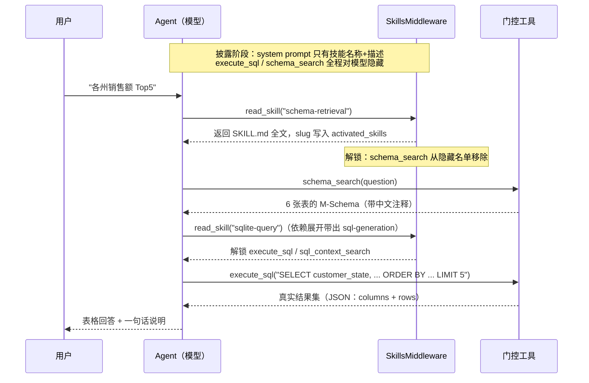

# Data Agent · 智能数据分析 Agent 平台

> 一个支持自然语言查询、Skills 插件化扩展、MCP 标准化工具接入的企业级数据分析 Agent。
> 一句中文问题 → 检索表结构 → 生成并校验 SQL → 在真实数据上执行 → 表格回答，全链路可观察、可评估、可追问。

本项目在架构上融合三个开源项目的核心思路（详见 [参考与致谢](#参考与致谢)）：Agent 平台与 Skills/MCP 机制借鉴 **Yuxi（语析）**，Text-to-SQL 与知识闭环借鉴 **SQLBot**，RAG 链路与评估体系保留自作者的 **my-agent**。定位是简历项目，取舍原则是"每一项都要能在面试里讲清为什么这么设计"——宁可少而深，不做只能演示、不能追问的功能。

---

## 核心特性

- **Skills 三段式（渐进式披露 → 激活门控 → 工具解锁）**：一个技能是一个目录（`SKILL.md` + 可选 `scripts/`）。system prompt 只注入每个技能的**名称 + 描述**，正文由模型 `read_skill(slug)` 按需读取；激活后其声明的门控工具才对模型可见。注入成本与技能正文长度、技能数量解耦——4 个内置技能全文注入约 **1183 tokens**，改为名称+描述后约 **150 tokens/请求**。
- **Text-to-SQL 全链路**：M-Schema（SQLBot 风格、带中文注释的表结构）+ 分层提示词（主规则/SQLite 方言/零容忍规则，写在 `SKILL.md` 里而非硬编码）+ sqlglot AST 校验（语法/只读/表列存在性/自动补 LIMIT）+ 引擎级只读（SQLite `mode=ro`）三层防护。
- **Analysis Agent（P-O-R 工作流）**：Planner 拆解 → 每步复用完整技能三段式 → Reflection 缺口补充（至多一次防循环）→ 结构化 Markdown 报告（SQL 清单取自真实工具轨迹）
- **容器沙箱**：技能脚本可切 Docker 一次性容器执行（断网/只读/资源限额/超时防孤儿），真机实测全绿；与"远程技能默认禁用"构成纵深防御
- **知识图谱**：LLM 三元组抽取 + SQLite/NetworkX 轻量图存储，`graph_search` 技能支持指标口径溯源（`GMV -[计算自]-> 订单项价格`）
- **持久化层**：SQLAlchemy 2.0 async 四表入库（skills/MCP/SQL示例/术语），对齐 Yuxi 的"内容存文件系统、索引存数据库"设计；`database_url` 一行切 PostgreSQL
- **异步执行**：ARQ + Redis Streams 事件流，长任务提交 / 状态查询 / SSE 进度订阅（断连续读、迟到回放）
- **技能语义匹配**：embedding 余弦召回 + jieba 自动回退（"帮我画个销售走势的图"这类关键词零交集的查询也能命中）
- **评估体系（可量化准确率）**：Text-to-SQL **执行准确率（execution accuracy）92.86%（26/28，qwen3.7-max）**，按 SQL 能力难度分桶；另有从 my-agent 迁回的 RAG 检索/生成双评估（Hit@k / Recall@k / MRR / NDCG + 基线对比）。大多数简历项目做不到"能量化自己的 Agent 有多准"。
- **工具熔断/重试/降级**：`ToolRuntimeMiddleware` 把每个工具包成独立断路器（closed → open → half_open 三态），按工具性质差异化超时与重试策略；外部依赖故障时不崩断 Agent 循环，而是回喂降级文案让 Agent 续跑。
- **MCP 标准化工具接入**：任意 MCP server 注册进平台，其工具经 langchain-mcp-adapters 转成 LangChain 工具；与 Skills 联动——**技能激活后才懒加载**对应 server 的工具，不激活一次连接都不发起。
- **LLM 厂商解绑**：`LLMFactory` 统一创建 `ChatOpenAI`，任意 OpenAI 兼容接口（DashScope compatible-mode / 美团 FRIDAY / 本地 Ollama）改配置即可切换，不改代码。

---

## 系统架构

分层：Vue3 前端 → FastAPI 网关 → `create_agent` 中间件栈 → Skills / MCP / 工具 → SQLite / Milvus / Redis。



中间件顺序 `[Skills, ToolRuntime]` 有意为之：先由 Skills 决定"这一轮哪些工具可见、动态 MCP 工具是谁"，再由 ToolRuntime 包住真正的执行。能力全部以 `AgentMiddleware` 挂载，而非写进图节点——图交给框架，能力可插拔。

---

## 端到端演示

真实 LLM 下，一句"各州销售额 Top5"跑完 Skills 三段式，**端到端约 13.4s**：



要点：**未激活技能的门控工具全程对模型不可见**（`execute_sql`、`schema_search` 虽在构建期已注册进 ToolNode，但被 `awrap_model_call` 从 `request.tools` 过滤掉）；每一步工具调用都出现在轨迹里——可观察、可讲解、可评估。

---

## 评估结果

Text-to-SQL 执行准确率（`evals/text2sql/`，模型 qwen3.7-max，28 例，报告 `evals/text2sql/reports/execution_latest.json`）：

| 难度标签 | 覆盖能力 | 准确率 | 通过 |
|---|---|---|---|
| 单表聚合 | GROUP BY / COUNT / SUM / AVG / WHERE | **100%** | 14 / 14 |
| 多表 JOIN | 2~3 表 JOIN + 聚合 + 别名 | 91.7% | 11 / 12 |
| TopN | ORDER BY + LIMIT（行序敏感） | 87.5% | 7 / 8 |
| 时间过滤 | TEXT 时间列区间 / strftime 按月 | 80% | 4 / 5 |
| CTE | WITH 子句 / 派生表 | 75% | 3 / 4 |
| **总计** | | **92.86%** | **26 / 28** |

### 4 模型对比（同一评估集）

| 模型 | 总体 | 单表聚合 | 多表JOIN | TopN | 时间过滤 | CTE |
|---|---|---|---|---|---|---|
| **qwen3.7-max** | **92.9%** | 100% | 91.7% | 87.5% | 80% | 75% |
| qwen3.7-plus | 89.3% | 100% | 83.3% | 75% | 80% | 75% |
| qwen3-coder-plus | 85.7% | 100% | 75% | 62.5% | 80% | 50% |
| qwen3-coder-flash | 82.1% | 100% | 66.7% | 50% | 80% | 50% |

两个结论：**代码特化模型反而更差** —— 这条链路的瓶颈是中文业务语义理解与分层提示词遵循，
不是 SQL 语法；**简单任务全员满分**，说明 M-Schema + 提示词分层的地基有效，模型差异只在难例显现。
明细报告见 `evals/text2sql/reports/execution_<model>.json`。

判定口径是**执行准确率**而非 SQL 文本相似度：把 golden SQL 与模型 SQL 分别在同一库上执行，比较结果集是否等价（吸收列序、行序、浮点容差三类无关差异）。因为用户要的是正确数据，不是正确字符串。

> 分桶报告用于定位"哪类查询最弱"。当前两个失败例都出在**排序稳定性**上：TopN 并列时若模型漏了次级排序键（tiebreaker），边界行会与 golden 不一致——这既是模型的短板，也是评估集设计的一课（见 `docs/interview-guide.md` §3）。

---

## 快速开始

前置：Python ≥ 3.11、Node ≥ 18、[uv](https://github.com/astral-sh/uv)。Chat 主链路**不依赖** Milvus / Redis，可离线跑通。

```bash
# 1) 安装依赖（uv 按 pyproject.toml 解析，创建 .venv）
uv sync

# 2) 导入演示数据（合成模式，固定种子、离线可复现，无需 Kaggle 账号）
python scripts/import_ecommerce.py --synthetic --db ./data/ecommerce.db
#   或从 Kaggle Brazilian E-Commerce (Olist) CSV 导入：
#   python scripts/import_ecommerce.py --csv-dir ~/Downloads/olist

# 3) 配置 LLM（任意 OpenAI 兼容接口）
cp .env.example .env
#   编辑 .env：至少设置 LLM_API_KEY / LLM_BASE_URL / LLM_MODEL

# 4) 起后端（默认 9900）
.venv/bin/uvicorn app.main:app --reload --port 9900

# 5) 起前端（另开一个终端）
cd frontend && npm install && npm run dev    # 访问 http://localhost:3000

# 6) 跑测试（当前 113 passed）
.venv/bin/python -m pytest -q

# 7) 跑 Text-to-SQL 评估（--limit 抽样，--model 覆盖模型）
.venv/bin/python -m evals.text2sql.run_execution_eval --limit 10
```

关键环境变量（完整见 `.env.example`）：`LLM_MODEL` / `LLM_API_KEY` / `LLM_BASE_URL`（自定义 endpoint，如美团 FRIDAY）、`SQLITE_DB_PATH`（演示库路径）、`SAVE_DIR`（skills 落盘 / MCP 注册表）、`ENABLE_KB_TOOL`（知识库工具，需 Milvus，默认 false）。

---

## 技术栈

| 层 | 选型 |
|---|---|
| Agent 框架 | langchain **1.3.14** / langchain-core 1.5.1 / langgraph **1.2.9**（v1 `create_agent` + `AgentMiddleware`） |
| LLM 接入 | langchain-openai 1.4.1（`LLMFactory` → 任意 OpenAI 兼容接口） |
| MCP | langchain-mcp-adapters 0.3.0 |
| Web | FastAPI 0.139.2 + uvicorn；前端 Vue 3.4 + Vite（+ marked / highlight.js） |
| SQL | sqlglot 30.13.0（AST 校验）+ SQLite（演示库，引擎级只读） |
| RAG / 检索 | pymilvus + BM25（rank-bm25）+ jieba 分词 + BGE 重排（按需安装 torch/FlagEmbedding） |
| 存储 | SQLite（演示库）/ Milvus（向量，可选）/ Redis（依赖预留） |

---

## 项目结构

```
data-agent/
├── app/                          # 后端应用
│   ├── agents/                   # Agent 核心
│   │   ├── chat_agent.py         #   ChatAgent —— create_agent 薄封装
│   │   ├── middlewares.py        #   ToolRuntimeMiddleware（熔断/重试/降级）
│   │   ├── tool_runtime.py       #   断路器状态机 + 每工具策略（保留自 my-agent）
│   │   └── tools/                #   schema_search / execute_sql / sql_guard / sql_context / ...
│   ├── skills/                   # Skills v2：目录模型 + 渐进披露 + 激活门控
│   │   ├── middleware.py         #   SkillsMiddleware（三段式主实现）
│   │   ├── service.py            #   加载/查询/依赖展开/jieba 中文匹配/目录原子导入
│   │   ├── tools.py              #   read_skill（激活入口）/ run_skill_script
│   │   ├── remote_install.py     #   git clone 整目录安装，默认 enabled=False
│   │   └── buildin/              #   4 个内置技能
│   ├── mcp/                      # MCP 注册表 + 工具懒加载（并行/超时/缓存/失败隔离）
│   ├── text2sql/                 # M-Schema 生成 / 注释字典 / 示例库 / 术语库
│   ├── rag/                      # 分块 / 混合检索（Milvus+BM25）/ BGE 重排（保留自 my-agent）
│   ├── api/                      # FastAPI 路由（chat / skills / mcp / knowledge / ...）
│   ├── core/                     # settings / llm(LLMFactory) / dependencies（唯一组装点）
│   ├── services/ · clients/ · schemas/
│   └── main.py
├── frontend/                     # Vue3 + Vite 前端（对话 / Skills / MCP / 知识库 / 状态）
├── evals/
│   ├── text2sql/                 # 执行准确率评估（本项目差异化亮点）
│   └── rag/                      # 检索/生成评估（迁回自 my-agent）
├── scripts/import_ecommerce.py   # 演示数据导入（Kaggle CSV / 合成两种模式）
├── tests/                        # 113 个 pytest 用例（11 个测试文件）
├── docs/openspec/                # 设计规格（OpenSpec）
├── data/ecommerce.db             # 演示库（导入后生成）
├── REQUIREMENTS.md               # 需求文档 + 参考项目功能全景对照
└── pyproject.toml
```

---

## 文档索引

**设计规格（`docs/openspec/`）**

| 文档 | 内容 |
|---|---|
| [skills-system.md](docs/openspec/skills-system.md) | Skills v2 系统规格：三段式运行时、依赖模型、安全边界、与 Yuxi 的差异 |
| [skills-optimization.md](docs/openspec/skills-optimization.md) | 对标 Yuxi 的差距分析与优化方案，含 5 个已验证缺陷的复盘 |
| [mcp-system.md](docs/openspec/mcp-system.md) | MCP 系统规格：数据模型、工具加载、与 Skills 联动、安全边界 |
| [roadmap.md](docs/openspec/roadmap.md) | 开发路线图（P0/P1/P2）与简历叙事对照 |

**实现速读（各模块 `IMPLEMENTATION*.md`）**

| 文档 | 模块 |
|---|---|
| [app/agents/IMPLEMENTATION-agent-core.md](app/agents/IMPLEMENTATION-agent-core.md) | Agent 核心：create_agent + LLMFactory + 工具熔断 |
| [app/agents/tools/IMPLEMENTATION-sql-guard.md](app/agents/tools/IMPLEMENTATION-sql-guard.md) | SQL 校验层（sqlglot AST：只读/表列存在性/CTE 排除/自动 LIMIT） |
| [app/skills/IMPLEMENTATION.md](app/skills/IMPLEMENTATION.md) | Skills v2：目录模型 + 渐进式披露 + 激活门控 |
| [app/mcp/IMPLEMENTATION.md](app/mcp/IMPLEMENTATION.md) | MCP：注册表 → 工具加载 → 技能懒加载（修正 Yuxi 四个问题） |
| [app/text2sql/IMPLEMENTATION.md](app/text2sql/IMPLEMENTATION.md) | Text-to-SQL 核心：M-Schema + schema_search 门控工具 |
| [app/text2sql/IMPLEMENTATION-knowledge.md](app/text2sql/IMPLEMENTATION-knowledge.md) | SQL 示例库 + 术语库（"越问越准"知识闭环） |
| [app/db/IMPLEMENTATION.md](app/db/IMPLEMENTATION.md) | 持久化层：async SQLAlchemy 四表、JSON 迁移、种子幂等 |
| [app/tasks/IMPLEMENTATION.md](app/tasks/IMPLEMENTATION.md) | 异步任务：ARQ + Redis Streams + SSE |
| [app/skills/IMPLEMENTATION-matching.md](app/skills/IMPLEMENTATION-matching.md) | 技能语义匹配：embedding 召回 + jieba 回退 |
| [app/agents/IMPLEMENTATION-analysis.md](app/agents/IMPLEMENTATION-analysis.md) | Analysis Agent：P-O-R 状态机与防循环设计 |
| [app/skills/IMPLEMENTATION-sandbox.md](app/skills/IMPLEMENTATION-sandbox.md) | 容器沙箱：隔离 flag 威胁模型 + macOS/colima 实测记录 |
| [app/graph/IMPLEMENTATION.md](app/graph/IMPLEMENTATION.md) | 知识图谱：抽取容错、双层存储、Neo4j 升级路径 |
| [evals/IMPLEMENTATION.md](evals/IMPLEMENTATION.md) | 评估体系：Text-to-SQL 执行准确率 + RAG 检索/生成评估 |
| [frontend/IMPLEMENTATION.md](frontend/IMPLEMENTATION.md) | Web 前端：Vue3 迁移 + Skills/MCP 管理页 |
| [scripts/IMPLEMENTATION.md](scripts/IMPLEMENTATION.md) | 演示数据导入（Kaggle CSV / 合成数据分布设计） |

**面试**：[docs/interview-guide.md](docs/interview-guide.md) —— 面试防御手册（子系统三层问答 + 八个踩坑故事 + 数字速记 + 简历句到证据映射）。

---

## 项目状态

- 当前测试：**113 passed**（`main`）；死锁修复 PR 合并后为 115。
- 开发史：10 个 PR（#1–#9 已并入 `main`，#10 死锁修复待合并），中文 Conventional Commits 全程可追溯。
- 已完成：Skills v2 / MCP / Text-to-SQL 全链路 / SQL 校验 / 双评估体系 / SQL 示例库 + 术语库 / Web 前端。
- 二期（`docs/openspec/roadmap.md` §3）：持久化层（SQLite/PG）、异步执行（ARQ + Redis 事件流）、Analysis Agent（P-O-R 报告）、行列级权限、schema embedding 召回、语义匹配升级。

---

## 参考与致谢

本项目的设计与实现大量学习并借鉴以下开源项目，在此致谢（均为只读参考，未直接搬运代码）：

- **[Yuxi（语析）](https://github.com/xerrors/Yuxi)** —— Agent 平台架构、Skills 三段式机制、MCP 集成、中间件栈设计。
- **[SQLBot](https://github.com/dataease/SQLBot)** —— Text-to-SQL、M-Schema 表结构描述、分层提示词模板、sqlglot 安全校验、SQL 示例训练与术语库的"越问越准"运营闭环。
- **[my-agent](https://github.com/ysysn315/my-agent)** —— 作者的原项目，保留其 RAG 链路（分块/混合检索/BGE 重排）、工具熔断（`tool_runtime`）、评估体系（evals）与 Vue3 前端基座。

各模块相对参考项目的具体差异与取舍，见对应的 `IMPLEMENTATION*.md`"③ 参考项目怎么做的 / ④ 区别与取舍"小节。
