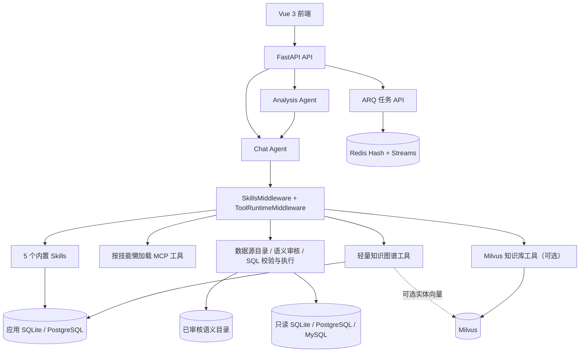

# Data Agent · 智能数据分析 Agent 平台

> 面向业务数据分析的 Agent 平台：把自然语言问题转化为业务上下文检索、SQL 生成校验、只读执行与结果解释，并通过 Skills/MCP、RAG、轻量知识图谱和多步分析扩展复杂任务能力。

## 当前状态

本文描述当前分支代码（2026-08-14）。实现事实以代码、测试和评测原始报告为准；历史需求与差距分析仅用于解释设计过程。

- 自动化测试：提交前使用 pytest/CI 验证；Docker/Redis 不可用时，外部集成用例会按环境跳过。
- Text-to-SQL：28 条分层用例；仓库内 3 份可区分的模型报告，最高执行准确率为 **89.29%（25/28）**。
- RAG：主 Chat 已接入 Milvus 稠密召回，并在知识库单例首次初始化时恢复 BM25 索引，统一走查询改写/扩展、BM25+向量 RRF 与可选重排；BGE 本地重排仍需额外安装，未配置时回退 LLM/融合排序。
- 沙箱与追踪均为可选能力：技能脚本默认使用 `subprocess`，可切换 Docker；Langfuse 默认关闭。

## 核心能力

- **Skills/MCP 插件体系**：system prompt 只披露技能名称与描述，模型按需读取正文并激活技能，之后才解锁本地门控工具或懒加载 MCP 工具。阶段测量中，提示词注入开销约由 1183 降至 150 tokens/请求。
- **Text-to-SQL 可靠链路**：支持工作空间接入 SQLite/PostgreSQL/MySQL，自动扫描物理 Schema，LLM 生成业务语义草稿，人工审核后才进入 M-Schema；`sqlglot` 按方言校验单语句、只读、表列和 LIMIT，数据库只读账号/事务再兜底。
- **RAG 知识库**：支持 TXT/Markdown/PDF/DOCX/HTML/CSV/JSON/Excel；表格会转换为带统计摘要的语义文本，分块后写入 Milvus。主 Chat 与独立实验链路共用 BM25+向量 RRF、查询改写/扩展和可选 BGE/LLM 重排。
- **轻量知识图谱**：图谱按 workspace/datasource 隔离，SQLite 持久化实体/三元组，支持已审核 Schema 同步、别名/属性合并、可选实体 Embedding 召回和 `graph_path_search` 路径工具；NetworkX 负责千级规模邻域/路径查询。它不是 GraphRAG，也不面向大规模图计算。
- **多步分析与异步任务**：Analysis Agent 按 Planner → Operation → Reflection 运行；ARQ 承载长任务，Redis Hash/Streams 保存状态与事件，SSE 推送进度并支持迟到订阅回放历史事件。
- **运行安全与降级**：工具调用支持超时、重试、三态熔断和错误回喂；技能脚本可切换到一次性 Docker 容器，以断网、只读挂载、资源限额和超时回收收敛执行风险。
- **可选平台能力**：SQLAlchemy 2.0 async 持久化、API Key 鉴权与 workspace-lite、推理模型思考/答案分流、Langfuse callbacks 均已实现，但默认配置不等于生产级多租户或全链路可观测平台。

## 系统架构



### 主对话中的 Text-to-SQL

```text
中文问题
  → 选择当前工作空间数据源
  → 披露技能名称与描述
  → read_skill 激活 schema / SQL 技能
  → schema_search 读取自动扫描且经人工审核的 M-Schema（当前为所选 Schema 全量返回）
  → 未选平台数据源时，可补充演示库的全局术语与 SQL 示例
  → LLM 生成 SQL
  → sqlglot 按数据源方言做 AST 校验与自动 LIMIT
  → 只读连接执行
  → Agent 解释结果
```

### RAG 的两层能力

| 层次 | 当前接线 | 能力边界 |
|---|---|---|
| 主 Chat | Agent 工具 → 知识库单例首次初始化恢复 BM25 → 查询改写/扩展 → Milvus + BM25 → RRF → 元数据过滤 → 可选重排 | Milvus 是持久化真相源；BM25 和文档列表均受上限约束，恢复、检索、写入和列表扫描放到工作线程；BGE 本地模型需额外安装 |
| 独立实验链路 | 与主 Chat 共用检索组件，可独立切换模型/开关 → RAG 生成 | 用于实验与评测，不等于生产级评测闭环 |

## 评测结果

### Text-to-SQL

判定口径是 **execution accuracy**：golden SQL 和模型 SQL 在同一数据库执行后比较结果集，而不是比较 SQL 字符串。比较过程处理列序、无显式排序时的行序和浮点容差。

| 报告 | 正确数 | 准确率 |
|---|---:|---:|
| `execution_qwen3.7-plus.json` | 25 / 28 | **89.29%** |
| `execution_qwen3-coder-plus.json` | 24 / 28 | 85.71% |
| `execution_qwen3-coder-flash.json` | 23 / 28 | 82.14% |

`execution_latest.json` 当前与 coder-flash 报告相同（23/28），不是最高成绩。仓库没有可核验的 qwen3.7-max 26/28 原始报告，因此项目文档和简历都不再使用旧的 92.86% 数字。

### RAG

- 检索数据集：40 条，覆盖普通、困难、易混淆与噪声干扰问题。
- 分层生成数据集：60 条模板，覆盖 single-hop、multi-hop、confusable 和 no-answer。
- 指标：Hit@K、Recall@K、MRR、Precision@K、NDCG、MAP、事实召回、来源精确率与幻觉惩罚。
- 仓库保留的 baseline 来自旧链路：检索 40 条、生成 8 条。它可作历史参照，但缺少当前完整实验产物，不能宣称本项目已实现某个 RAG 指标提升。

详见 [评测体系](evals/IMPLEMENTATION.md) 与 [RAG 评测说明](evals/rag/README.md)。

## 快速开始

前置：Python 3.11+、Node 18+、[uv](https://github.com/astral-sh/uv)。默认 Chat/Text-to-SQL 不依赖 Milvus、Redis 或 Docker；对应可选能力启用后再启动基础设施。

```bash
# 安装依赖
uv sync

# 准备固定种子的演示数据
.venv/bin/python scripts/import_ecommerce.py --synthetic --db ./data/ecommerce.db

# 配置 LLM：编辑 .env，至少设置 LLM_API_KEY / LLM_BASE_URL / LLM_MODEL
cp .env.example .env

# 若接 PostgreSQL/MySQL，再生成并固定 DATASOURCE_SECRET_KEY（不要提交 .env）
.venv/bin/python -c "from cryptography.fernet import Fernet; print(Fernet.generate_key().decode())"

# 后端
.venv/bin/uvicorn app.main:app --reload --port 9900

# 前端（另一终端）
cd frontend
npm install
npm run dev

# 测试
cd ..
.venv/bin/python -m pytest -q
```

需要异步任务时启动 Redis 和 worker：

```bash
docker compose up -d redis
.venv/bin/arq app.tasks.worker.WorkerSettings
```

需要知识库工具时启动 Milvus，并设置 `ENABLE_KB_TOOL=true`。需要 Docker 技能沙箱时提前拉取镜像并设置 `SKILL_SANDBOX_MODE=docker`；默认仍是 `subprocess`。

### Text-to-SQL 评测

```bash
.venv/bin/python -m evals.text2sql.run_execution_eval --limit 10
```

RAG 评测依赖 Milvus、Embedding、LLM、可选重排模型和测试语料；运行前请先看 [RAG 评测说明](evals/rag/README.md)，不要把历史 baseline 当成当前可复现结果。

## 项目结构

```text
app/
├── agents/       # Chat / Analysis Agent、工具与运行时中间件
├── api/          # FastAPI 路由
├── core/         # 配置、依赖注入、鉴权、LLM、Langfuse
├── db/           # SQLAlchemy async 持久化
├── datasources/  # 数据源连接器、结构快照、凭证加密、语义审核与运行时
├── graph/        # 三元组抽取、SQLite/NetworkX 查询
├── mcp/          # MCP 注册、测试、加载与缓存
├── rag/          # 文档解析、分块、检索、改写、重排
├── skills/       # Skills 目录模型、门控、匹配与脚本沙箱
├── tasks/        # ARQ + Redis Streams 异步任务
└── text2sql/     # M-Schema、SQL 示例与术语
evals/
├── text2sql/     # 28 条执行准确率评测与原始报告
└── rag/          # 检索/生成数据集、指标和历史 baseline
frontend/         # Vue 3 前端
tests/            # 21 个测试文件
```

## 文档索引

### 当前实现说明

- [Agent 核心](app/agents/IMPLEMENTATION-agent-core.md)
- [Skills 系统](app/skills/IMPLEMENTATION.md) / [Skills OpenSpec](docs/openspec/skills-system.md)
- [MCP 系统](app/mcp/IMPLEMENTATION.md)
- [Text-to-SQL](app/text2sql/IMPLEMENTATION.md) / [SQL 安全校验](app/agents/tools/IMPLEMENTATION-sql-guard.md)
- [数据源与语义审核方案](docs/openspec/datasource-semantic-metadata.md)
- [RAG 评测](evals/rag/README.md) / [评测体系](evals/IMPLEMENTATION.md)
- [知识图谱](app/graph/IMPLEMENTATION.md)
- [Analysis Agent](app/agents/IMPLEMENTATION-analysis.md)
- [异步任务](app/tasks/IMPLEMENTATION.md)
- [技能脚本沙箱](app/skills/IMPLEMENTATION-sandbox.md)
- [Langfuse 追踪](app/core/IMPLEMENTATION-tracing.md)
- [持久化](app/db/IMPLEMENTATION.md) / [鉴权与工作空间](app/core/IMPLEMENTATION-auth.md)
- [面试防御手册](docs/interview-guide.md)

### 历史与规划文档

- [REQUIREMENTS.md](REQUIREMENTS.md)：最初需求基线，保留当时的计划和取舍，不代表当前实现状态。
- [skills-optimization.md](docs/openspec/skills-optimization.md)：Skills v1 差距分析，完成项以当前 Skills 文档为准。
- [roadmap.md](docs/openspec/roadmap.md)：当前能力盘点与后续计划。
- `docs/research/`：外部方案调研，只用于设计比较，不代表本项目已经具备对应生产能力。

## 已知边界

- `schema_search(question)` 尚未使用问题做相关表筛选；演示库返回全部 6 张表，平台数据源返回所选 Schema 的全部表，大库仍需表级召回与 token 预算。
- `datasource_id` 已贯通同步/流式 Chat、同步 Analysis 和 ARQ Chat/Analysis 任务；Text-to-SQL 评测仍固定使用演示数据源。
- 前端尚无登录/API Key 注入层；启用鉴权后的远程数据源管理需通过 API、统一网关或后续登录页操作。
- 主 Chat 已接入完整 RAG 检索组装；本地 BGE 重排需要安装 `torch`/`FlagEmbedding`，否则使用配置的 LLM 重排或融合顺序。
- 顶层 Chat 请求的 `metadata_filters` 已合并到知识库工具过滤条件；非流式 Chat 和 API 流式 SSE 的 `sources` 均来自实际命中的文档。
- RAG 评测脚本已改为复用 `LLMFactory` 和当前配置字段；仍需要 Milvus、Embedding 服务与测试语料，历史报告不等于本次主链路的线上指标。
- Docker 沙箱不是默认执行模式，也不是生产级多租户代码执行平台。
- SSE API 能回放 Redis Streams 中已有事件，但尚未暴露 `Last-Event-ID/after_seq`，前端也未做自动重连，因此不宣称断点续传。
- Langfuse 默认关闭，当前只在部分 Agent 图入口注入 callbacks，没有会话标签、反馈评分或完整 tracing 闭环。
- 鉴权和 workspace-lite 只覆盖明确接线的资源，不等于所有知识库、图谱和数据源均已完成租户隔离。

## 参考与致谢

项目吸收了 Yuxi 的 Skills/MCP/异步架构思想、SQLBot 的 Text-to-SQL 领域设计，以及前序项目的 RAG 与评测代码。参考实现只用于设计对照；本仓库的当前能力、测试和限制以上述事实基线为准。
